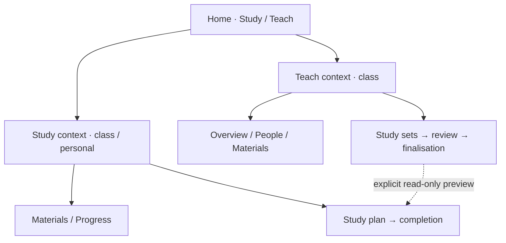

# StudyGrid product-design synthesis / divergence gate

To General CF-0047 from Sol CF-0043 · Q-SOL3 · 2026-10-01

**Design deliverable: DONE. Recommendation: context workspace with a guided study journey. Implementation release: HELD.**

Three complete systems are compared below. The recommendation is a design judgement, ready for General/Nathan to select or amend; it is not implementation approval, a tested prototype, an auth design, or a release. No accepted HTML, product state, backend, deployment, or 3D asset was changed. No peer was activated. STARTED was provider-read at WORKER row65 under TX-0271 before design execution.

## Purpose and evidence contract

The person should be able to explain where they are, their current context and role, why this surface exists, the strongest next action, what just happened, and how to leave or continue. A class is a supported study context; it is not a prerequisite for personal study. A recommendation must have an observable reason, such as an unfinished lesson, explicitly selected topic, or actual due item. Do not invent adaptive mastery, a due schedule, or a connected account behind example data.

| Evidence class | Binding input / consequence |
|---|---|
| OWNER-DIRECT through exact General routes | Purpose→research→diverge→compare/select→implement→independent QA; meaningful signed-in Home; one next step; class + personal study; continuous welcome loop; stable repeated targets; role truth; automatic earned Seeds; no implementation yet. Owner observations establish experienced problems, not every proposed technical cause. |
| SHARED-PRIMARY, mechanically inspected | Accepted candidate `StudyGrid-CF0042-QB17R2-stuart-defect-repair.html`, Drive `1k0d69ZOrgs4NRRLRORKBmIwOR1Q0mE46`, SHA-256 `874e4a743050d308759a9dcaefa9cc3296f8841c37b12e3acf5df2225ea49aab`, 1,063,586 bytes, v7.20-cf0042-qb17r2-stuart-defect-repair. Local retained bytes rehashed this run. Prior source audit has exact-JS isolated detectors, not browser geometry evidence. |
| INHERITED-FROM-ROUTE Research | Research terminal supplies wayfinding, learning, motion, accessibility evidence and three welcome treatments. Its conclusions remain attributed; this synthesis does not claim to rerun learning studies or conduct external UX research. |
| INHERITED-FROM-ROUTE Bob | Persistent shell/outlet is technically feasible on existing hash/History transport. Full-root remounting is a substantial seam; direct Learn/Test/Support switches already preserve the outer shell, so not every complaint is caused by full-root remounting. |
| PRIMARY-DIRECT standards check in this run | W3C dragging and pause guidance, APG tabs, OASIS interaction distinctions and the 1EdTech QTI specification register were opened. They support constraints, not the choice of a winning StudyGrid IA. URLs and limits are in the source register. |
| DESIGN JUDGEMENT | The three systems, their comparative assessment, proposed state/read models, labels, visual hierarchy and recommended synthesis. No model agreement substitutes for measured usability. |
| UNRESOLVED | Native multi-select failure, measured target movement/focus-square paint, actual Seeds save-failure cause, exact speech terms/visual reference, and q4m's course-source construct. Carry forward; do not manufacture reproduction or legal correction. |

Correlation: this is the same Sol lane that produced the source audit, sharing General's framing and Research/Bob evidence. It is a separate design exercise, not a less-correlated independent QA verdict. No new Astra return is required by current authority. Historical Astra packages were not needed or consumed for this recommendation.

## A. Three materially different complete systems

### System A — Context workspace

**Organising object: the selected class or personal collection.** Home resumes real work; within a context, Study, Materials and Progress are discoverable peers. The user chooses a context, then an activity. This retains the owner's liked class-tab model while reducing the number of starting points.

**Composition.** One quiet app header contains Home, a compact workspace switcher (`Study` / `Teach` where available), and account access. Beneath it, one context strip holds the selected class/collection and easy switching. The main surface has a clear heading and one recommended action. No always-open duplicate course rail. A short context nav remains fixed as content changes. During an active session it becomes a session title, progress and pause/leave controls; exploration is available through a deliberate return to the context, rather than surrounding each question with destinations.

**Typical task.** Home shows `Continue learning · [class]` and its reason. Entering the class opens the recommended lesson or the class Study start. A short orientation leads to retrieval, optional confidence, concise feedback, error review and completion. Completion offers the next sourced section/topic when available, or `Choose your next topic` without pretending another task was scheduled.

| Required coverage | System A contract |
|---|---|
| 1. Home/current workspace | One durable Home for the active Study/Teach workspace. Study Home leads with unfinished work; Teach Home leads with a real review/publishing task. Same `Home` label, visibly different workspace context. Empty Home explains the first useful task. |
| 2. Class + personal entry | Home has subordinate `Classes & collections` and `Study your own material`. Join/create class is an action in that organiser. Personal collection creation asks for material/topic, not school/class metadata. Unsupported import/generation stays truthful and unavailable in a local prototype. |
| 3. Class shell/switching | One selected-context strip; a small number of recent class tabs plus `All contexts` selector. No duplicate course identity in top bar, rail and pane. Personal collection occupies the same strip with a textual `Personal` marker. |
| 4. Learner journey | One `Continue learning` default; Materials browsing can launch a topic plan. Study start explains the job and planned stages. Confidence is optional, feedback is concise, completion is forward. Assessment is a declared deferred-feedback policy, not the entire teaching experience. |
| 5. Instructor/context entry | `Teach` workspace has Home and a selected-class workspace with Overview, Study sets, People and Materials. Announcements live in Overview; Sources in Materials; class recognition in People/Overview. `Preview as learner` enters a clearly labelled preview with `Return to teaching`; ordinary study is a separate deliberate Study workspace switch. |
| 6. Set review/finalisation | Study sets opens list→set→review workbench. Queue rail, content and action dock persist. Last decision yields a review summary with remaining/held/changed counts and a separate publication action. Review approval never publishes. |
| 7. Home/Back/Up/exit | Home→context→surface→session is semantic hierarchy. Up is labelled with the actual parent, e.g. `Materials` or `Study sets`. Browser Back restores meaningful history. Sign out is account exit; onboarding is outside signed-in hierarchy. |
| 8. Persistent chrome | Retain app header and one context strip/nav. Merge Courses/Study top destinations into Home/context model; account menu owns Profile/Settings/Help/Feedback. No feedback zero-count chip. Session/review header and stable dock replace excess exploration chrome. |
| 9. Spatial relationships | Context surfaces are siblings: fixed strip, quiet outlet replacement. Lesson/session is deeper: heading/context continuity, purposeful focus entry. Class switch is a context switch with updated heading, not a tiny unnoticed tab change. |
| 10. Welcome loop | Research A: ordered shared-axis slide in a fixed stage, continuous 1→2→3→1 while idle, with explicit Pause/Play, readable rest periods and stationary CTA. A short reset/dissolve signals 3→1 rather than pretending step3 leads to a fourth learning stage. |
| 11. Focus/motion | Real page/context entry focuses the new heading; sibling controls retain focus; review advance focuses a stable content heading after keyboard use. Common visible-focus family; static/manual welcome under reduced motion. |
| 12. Responsive | Desktop may show a collapsed outline within Materials only. Tablet uses full-width outlet and compact context selector. Phone uses one context selector, context links that wrap without horizontal-only dependence, and a safe-area-aware action dock. Reading can scroll; fixed bars cannot cover text/focus. |
| 13. Bob mapping | Strong fit to Bob A: persistent signed-in shell with context outlet and task sub-outlet. Existing hash transport retained; one route/state update path replaces custom bookkeeping. Medium migration risk; route/focus QA is substantial. |
| 14. Preserve | Class switching/edge colours, Continue learning, course orientation/Scenario Lab as contextual content, 15-item review, fast approvals, source provenance, optional confidence, honest learning evidence and reward rollback. |

**Tradeoff.** Explicit context navigation gives a reliable escape from recommendations, but three peers still need clear jobs. Study means a planned learning task; Materials means find/read content; Progress means inspect actual evidence. Support is a contextual help/tool panel, not an equal study destination. `Test` remains a deliberate assessment or self-check action with declared policy. This IA needs a Home that earns its place; a class-list-only Home would fail the concept.

### System B — Guided work queue

**Organising object: a task/learning plan.** Home is a queue of useful next work across contexts. The user chooses what to accomplish, and the foreground workbench opens the required material at the relevant stage. Class and role are task metadata. There are no peer Learn/Test/Support destinations.

**Composition.** Home has one large `Next` card, a short upcoming-work list and a subdued browse entry. Opening a task enters a workbench with a persistent phase rail on desktop and a compact step summary on phone. The phases are `Understand`, `Try`, `Review`, `Finish` where the plan actually needs them; stages are not fake progress for a task that contains only practice. The active task and context remain in the header. Source/help panels open locally. Instructor review is another task shape, with its own explicit role marker and decision dock.

**Typical task.** Home suggests `Finish [topic]` because a saved plan is unfinished. The learner reads a source-linked explanation, completes varied response formats, reviews errors and reaches a checkpoint. Completion proposes the next plan. The workbench makes the chronology obvious, but the user may choose another task or browse material.

| Required coverage | System B contract |
|---|---|
| 1. Home/current workspace | Task queue across enrolled classes and personal plans. One recommended task; groups identify contexts without many equal cards. Teach workspace changes the queue to reviews, source checks and publication tasks. |
| 2. Class + personal entry | `Choose a task` can scope to a class/topic; `Start from your material` creates a personal plan without class setup. A small organiser manages memberships and collections. |
| 3. Class shell/switching | No class destination shell during execution. Header context selector filters Home/task chooser; switching during a task pauses it before opening another. Class tab familiarity is reduced; recent contexts remain shortcuts on Home. |
| 4. Learner journey | The plan is the primary navigation. Orientation/practice/error-review/completion form one guided sequence with explicit progress and a fixed Next target. Readiness evidence determines whether teaching is needed; an always-accessible explanation prevents quiz-only confusion. |
| 5. Instructor/context entry | Teach queue opens set-review tasks. `Preview learner plan` opens a preview task with visible no-evidence/no-reward status and a stable return. `Study for myself` deliberately switches workspace; roles never derive from a route prefix alone. |
| 6. Set review/finalisation | `Review 15 questions` is a bounded workbench task; queue decisions and finalisation are stages. Held/changes stop readiness; publication is a separate follow-on task, not automatic completion. List/filter access remains through organiser. |
| 7. Home/Back/Up/exit | Home is queue root. Task route is a child; item/stage changes are task-state updates rather than one history entry per answer. Up is `Tasks` or `Study sets`. Browser Back from a task pauses/returns to actual origin; explicit Resume owns recovery. Sign out is separate. |
| 8. Persistent chrome | Home, task title/context, workspace/account and task progress. Remove course rail, top Courses/Study duplication and mode tabs. Material tools are in the workbench. Profile/help remain account commands. |
| 9. Spatial relationships | Phase changes occur in one stable workbench; progress marker updates locally, content quietly replaces. Task entry expands a task card into the workbench; task/context switches use distinct heading/context updates. |
| 10. Welcome loop | Research B: stable-stage crossfade with sequential number/progress emphasis. Continuous cycling while idle, real Pause/Play and static semantic 3-step list. Lower movement suits the later quiet guided task model. |
| 11. Focus/motion | Fixed Next/Submit location where feasible; phase heading gets deliberate focus after a keyboard advance, status changes do not steal focus. No mandatory drag or motion; phase state is textual. Reduced motion removes card expansion/translation. |
| 12. Responsive | Desktop phase rail is compact; tablet turns it into a top progress row; phone exposes `Step 2 of 4 · Try` plus an expandable overview. The workbench uses one scroll axis and a reserved bottom action zone. Queue remains a simple list on small screens. |
| 13. Bob mapping | Shell/outlet fits Bob A, but route views alone do not create task plans. Requires an explicit plan/task state layer and new recommendation semantics; existing currentSession can feed it only where data is real. Higher product/state migration risk than A. |
| 14. Preserve | Continue learning, bounded fast review and source context are strengthened. Preserve course recognition/edge colours and exploration, but class tabs move to entry points. This knowingly weakens a liked always-available class-switch affordance. |

**Tradeoff.** Strongest immediate next-action clarity; highest risk of an over-controlling or falsely intelligent planner. A local fixture cannot claim to know the best thing to learn unless it can state the reason. Hard to inspect a whole course without stepping out to the organiser. Building task queues without defined content plans would simply rename the current problem.

### System C — Material library and study canvas

**Organising object: a material/topic collection.** Home is a personal library with class collections alongside personal collections. Reading is the primary environment; practice is an explicit canvas attached to the material. Users choose the material they need, then act on it. Instructor work edits the same material collection in a visibly different workspace.

**Composition.** Home combines a prominent `Continue [material]` entry with a searchable library. Selected collection opens a slim topic outline and a large reading canvas. A contextual `Study this topic` command opens an adjacent or replacing practice canvas. Desktop keeps the source/explanation inspectable in a bounded pane during learning; assessment closes answer-revealing material until completion. Phone swaps between material and task with labelled links, not a tiny split screen. A separate instructor review canvas has stable decision tools.

**Typical task.** Open a class collection, resume the next unread section, then launch `Practise this topic`. The task teaches from the selected material where needed, quizzes with concise feedback, and completes with progress beside the original topic. The next recommendation is another actual section/topic in this collection.

| Required coverage | System C contract |
|---|---|
| 1. Home/current workspace | Library root with one Continue item, recent material and collection search. Teach workspace shows managed collections and actionable review badges. No separate empty Your classes page. |
| 2. Class + personal entry | Class and personal collections share the organiser. Class membership is a collection source/access relationship; personal material has no instructor/publishing controls. `Add material` is central; join/create class remains secondary. |
| 3. Class shell/switching | One collection selector and topic outline. Classes appear as tabbed recent collections on desktop; tablet/phone use labelled selector. Collection identity appears once above the canvas. |
| 4. Learner journey | Reading/orientation→Study this topic→response/confidence/feedback→error review→completion→next material. Task canvas has stable Submit/Next targets; material remains optional support in learning, withheld where assessment policy requires. |
| 5. Instructor/context entry | Teach opens editable collection workspace: Materials, People and Study sets; Home is global Teach Home. `Preview` opens read-only learner material canvas with return. Switching to own Study is explicit and changes evidence ownership. |
| 6. Set review/finalisation | Review canvas displays question/rubric with source provenance in a contextual drawer. Fixed queue and decision dock; final summary marks readiness; separate publication confirmation. Library has state filters and actual revision labels. |
| 7. Home/Back/Up/exit | Home→collection→topic→study canvas. Up returns to named topic/collection regardless of entry. Browser Back returns to actual source location and selection; task actions do not fill history. Account Sign out exits product state. |
| 8. Persistent chrome | Library/Home, collection identity/selector and outline where useful. Merge Learn/Notes/Browse lessons into Materials; remove global Study destination and always-open help rail. Practice/Test commands exist at material/context level. |
| 9. Spatial relationships | Topic switching changes the canvas within fixed outline. Study opens from the topic with anchored continuity; closing returns to reading anchor. Collection switches are higher-level changes, with title/focus update. |
| 10. Welcome loop | Research C: restrained cyclic rotor/card turn in a fixed hero stage; idle continuous loop, explicit Pause/Play, static/manual reduced motion. Strongest visual brand continuity, but text must settle face-on before reading. |
| 11. Focus/motion | Source/help drawers use labelled disclosure/dialog semantics; focus returns to trigger. Optional split-pane resizing cannot require drag. In assessment, no source drawer may expose the answer. Canvas/task heading entry is explicit. |
| 12. Responsive | Desktop optional outline + reading/task panes; tablet uses one main canvas and source drawer; phone uses stacked routes/panels with clear return labels and preserved reading anchor. No mandatory narrow split view or horizontally overflowing answer layout. |
| 13. Bob mapping | Persistent shell + collection outlet + optional task outlet fits Bob A. More reading-anchor/source-pane state than A; partial drawer updates fit Bob B locally. Requires careful assessment reveal policy and additional tablet QA. |
| 14. Preserve | Strongest preservation of course context, notes, source-context practice and Scenario Lab. Continue learning, easy collection/class switching and review queue survive. Provenance is accessible without a metadata wall. |

**Tradeoff.** Best for source-led exploration and varied personal material. It risks recreating a big outline/rail and presenting practice as an optional afterthought. Reading flags can appear to be learning progress unless clearly distinguished. The rotor is the most distracting welcome candidate and should not spread into routine learning surfaces.

### Shared non-negotiables in all three

All systems use the same domain-neutral interaction engine (§F2); the organising object does not change item scoring or source truth. In A an item is mounted in the session outlet, in B in a plan stage, and in C in the practice canvas. A law item and an engineering item with the same response construct get the same accessible controls and attempt policy. A role is an explicit workspace state; personal is a content context, not an authorisation role. Instructor preview creates no learner attempts, grades, progress or Seeds. These are proposed product contracts, not permission checks already implemented in the local candidate.

All three preserve keyboard focus, browser history, reduced motion, local/example truth, original attempts, revision binding, publication separation, reward deduplication/rollback and privacy choices. They must resolve SOL-F01…F06 and pool divergence. All retain ordinary discoverable settings; no settings are buried merely to make the screen look simpler.

## B. Comparison and selection

This is a qualitative design comparison, not measured usability, a numerical score or a model-vote tally. Accessibility obligations can be met in every candidate; implementation and task risk differ.

| Criterion | A — Context workspace | B — Guided queue | C — Material canvas |
|---|---|---|---|
| Purpose/task clarity | Strong default Continue, with explicit browse/study jobs | Strongest chronology if real plans exist | Clear source/read job; study launch needs explanation |
| Orientation/wayfinding | Strong: one named context + shallow peer nav | Task is obvious; broader course location less obvious | Strong material/topic location; global task priority weaker |
| Spatial stability | Persistent context strip and task docks | Best within one foreground task | Stable canvas; split/drawer boundaries add responsive risk |
| Cognitive/choice load | Small peer set plus one recommendation | Lowest execution choices, more planner policy | Higher exploration choice, reasonable for finding content |
| Class + personal coherence | Both use one context contract | Both are task sources; class model recedes | Both are collections; strongest source symmetry |
| Learner/instructor coherence | Explicit Study/Teach switch + preview return | Role marked on tasks; mixed queues must be forbidden | Explicit read/edit workspace; same material can blur intent |
| Learning-flow clarity | Strong after adding B-style planned session | Strongest; teach/try/review are built into plan | Reading first supports teaching; retrieval may become optional |
| Accessibility/reduced motion | Conventional headings/links/outlets; easiest to bound | Guided state announcements need careful control | Extra pane/drawer interactions and reading anchors |
| Feasibility/rollback | Closest to existing routes/state; medium migration | New planner/recommendation semantics; higher risk | Extra material/task coordination; medium–higher risk |
| Beauty/coherence/restraint | Calm hierarchy; class edge identity and space retained | Very restrained foreground task; Home can feel generic | Editorial richness/source continuity; easiest to overcrowd |
| Owner requirements/source defects | Best overall preservation + coherent repair scope | Solves next-step confusion; weakens liked class tabs | Preserves context; risks large left chrome again |

**Recommend A as the product skeleton, B's staged session inside its Study outlet, and C's optional source/material drawer.** The synthesis has one primary IA, not three alternative navigation systems piled together. Home→context→Study/Materials/Progress remains A. B contributes only the bounded learning plan and completion model; no cross-context algorithmic task queue is introduced. C contributes source access and reading-anchor continuity, not a second persistent library rail or mandatory split screen.

Why this choice: it preserves the owner's useful class switch, maps most directly to current state/Bob's persistent shell, makes personal study equivalent without pretending it is a class, and adds chronology at the moment it is needed. B alone demands a larger planner/content-model commitment. C alone risks retaining the course-rail/too-many-starting-points problem. A can still fail if the new Home is only a wrapper around old menus: its prototype must demonstrate one real next action with a reason and useful completion.

The winning welcome recommendation is Research A's ordered shared-axis slide, bounded to a fixed stage. B's crossfade is the reduced/quiet fallback; the rotor stays an alternative for owner selection. Numbering and a stable semantic list convey sequence when all animation is removed. The visible 3→1 reset communicates an explanatory loop, not a never-ending signed-in learning task.

## C. Recommended surface hierarchy and visual contract

| Level | Surface / job | Main action | Persistent context |
|---|---|---|---|
| Public | Welcome / explain StudyGrid | Sign in or Try preview, according to actual capability | Exact preferred headline/subline used once; static 3-step explanation |
| Setup | Class join/create or personal material setup | Complete the specific setup | Explicit setup title; meaningful Cancel to signed-in Home where entered there |
| Signed-in root | Home in Study or Teach workspace | Continue actual study / review actual set | Home, Study/Teach switch, account |
| Study context | Class or personal collection | Continue learning | One context strip; Study, Materials, Progress |
| Materials child | Lesson/notes/topic/scenario | Continue section or Study this topic | Named parent, topic title, local outline only if useful |
| Study task child | Orient→retrieve→feedback→complete | Stable Start/Submit/Next/Finish | Context + purpose + bounded plan/progress; pause/leave |
| Teach context | Class overview | Current actionable review/manage task | One class strip; Overview, Study sets, People, Materials |
| Study sets child | Set list→set→review | Review pending item / finish review | State label, exact revision/counts, persistent queue/action dock |
| Finalisation child | Review summary / publication confirmation | Address remaining item or prepare publication | Approval and publishing clearly separate |
| Account/utility | Profile, Settings, Help, Feedback | Task-specific command | Workspace context retained when returning |

The preview edge preserves an origin token/return label and prohibits personal evidence/rewards. A context choice updates content identity, while a workspace choice updates the actor's job. A personal collection has Materials/Study/Progress but no People roster or class publishing surfaces.

**Screen anatomy for the recommended direction.** Home's hierarchy is greeting/context, one Continue/review panel, then compact contexts and recent material. Selected class has a single context strip followed by a stable surface nav, heading and recommended plan; the old broad left guidance becomes a short `How this study works` disclosure beside the plan. Active study has a bounded content column, optional source explanation and reserved action region. The review workbench has set title/state/counts, a question queue on wide layouts, question content, and a stable right-aligned decision target in the bottom action region. Phone replaces the queue rail with `Question 6 of 15` and a queue disclosure. These are composition requirements; no pixel-perfect rendering or beauty acceptance is claimed.

**Visual family.** Preserve the current dark/material identity and coloured class edges. Typography and spacing make title, reason and next action the strongest hierarchy; metadata moves to a source/details disclosure. Class colour identifies context, not correctness, focus and every success state simultaneously. Use one restrained active-tab indicator, one selected-answer marker, and a separate visible-focus indicator. Hover gloss travels only along the edge band; it never washes the whole reading surface. Feedback is a low-emphasis account/help command without a zero badge; useful pending status may appear inside its surface. Instructor `Professor Home` becomes `Home` with Study/Teach context visible. Ordinary Settings remains directly named in account and session controls.

**Stable geometry without unreadable clipping.** Keep mode/context controls outside variable truth preambles and item bodies. Reserve an action region, not an arbitrary fixed question height. Long stems/options/explanations scroll or grow inside the available reading area; the action target is stationary during ordinary same-viewport item advances. At zoom/short viewport/software keyboard conditions, use a non-overlapping in-flow action region if the fixed dock would obscure content. Measure target stability in that declared layout, and never sacrifice reading/focus visibility for a zero-pixel claim.

## D. Navigation / Back / Up / Home / Sign out

Proposed route meanings are design descriptors, not code or installed URL changes. Preserve compatible old deep links through explicit route-to-surface mappings after selection; do not assume that rewriting a hash is an auth guard.

| Operation | Intended destination/state | History, focus and truth |
|---|---|---|
| Home | Durable root of the active Study/Teach workspace | A deliberate destination, not history replay. Retain last context/session for Resume. Focus Home heading on entry. Home does not reset progress or sign out. |
| Browser Back/Forward | Actual prior/next meaningful navigation state | Restore context, outlet, scroll/reading anchor and logical focus where still present. Route and painted pane must agree. Never repeat an approval, submission, reward or publish action. The app cannot erase all prior browser history or prevent leaving its origin. |
| Semantic Up | Named parent independent of arrival | Label `Materials`, `Study sets`, or the class/collection name; do not label it generic Back. Uses a normal navigation destination. It need not equal the last visited surface. |
| Class/context switch | Same surface type in selected class/collection where meaningful | A meaningful context history entry. Update title/heading/context before focus entry. If surface does not exist in new context, open its overview/Study start with a reason; never transfer a set review or attempt to another class. |
| Same-level surface switch | Study / Materials / Progress, or instructor-local peers | One route transition mechanism handles link, direct URL and popstate. Browser-address state is updated consistently. Controls stay mounted; selected state changes. For actual tabs use APG keyboard behaviour; if peers are pages use links + current-page semantics rather than fake tab roles. |
| Learn/Test/Support compatibility | Study start or declared task policy; Support opens local help | These old meanings resolve through explicit compatibility mapping. Test must expose assessment/self-check policy and cannot silently become practice. No second hidden router or special pushState painter. |
| Session Submit/Next/Approve | State transition inside a task | Replace/update task checkpoint rather than push one history entry per answer. Back is not Undo. Revisiting a question shows its existing response or creates a separately identified new attempt only through an explicit retry. |
| Start/finish task | Child task route / explicit completion state | Start is meaningful navigation; finish is a terminal task state. Back from summary cannot silently resubmit/reaward. `Review missed` opens a new bounded review plan and preserves the original attempt. |
| Instructor learner preview | Read-only preview with recorded origin and return | Header says `Learner preview · [class]`; `Return to teaching` is stable. No progress/rewards/publication from preview. Deep-linked preview without origin returns to that class's Teach overview. |
| Study for myself from Teach | Deliberate switch into Study workspace | Explicit context and new heading; return workspace remains available. No ambiguous global Study link that silently changes the user's job. |
| Settings/Profile/Help/Feedback | Account/utility surface or local disclosure | Restore invoking workspace/context; profile route cannot silently change Teach to Study merely because its path lacks an instructor prefix. Dialog closes restore trigger focus. |
| Setup entered while signed in | Scoped join/create/material action | Cancel returns to Home or invoking organiser. Setup is not a parent of ordinary work. Old `/start` reached through signed-in history is reconciled to the meaningful current product surface. |
| Sign out | Explicit account exit | Keep learning data distinct from session identity according to existing storage/privacy policy. Actual connected sign-out must await separately authorised integration; local preview must label its exit truthfully. Never claim to revoke a server session in this no-backend gate. |
| Signed-in history reaches stale public/setup | Replace obsolete product entry with Home where appropriate | No bounce loop and no artificial trapping of browser Back. Browser can leave the app. A future real session guard requires its own approved implementation; this design only specifies public/setup are not signed-in parents. |

Task departure: ordinary navigation saves a pause checkpoint when persistence succeeds; otherwise give a truthful unsaved-work cue and allow Retry or Leave according to the actual state. Confirmation is justified only by real unsaved loss, not every harmless tab/class switch. A stored checkpoint pins session ID, context, item revision, response stage and progress. Route resolution is one source of truth; this is the design repair for SOL-F06's custom History bookkeeping mismatch.

## E. Motion, focus and welcome loop

Motion explains a relationship after the route/state is correct. State, focus and hit targets must work with every animation skipped or cancelled. Durations below are starting prototype hypotheses, not standards or measured preferences.

| Relationship | Proposed treatment | Fixed targets / accessibility |
|---|---|---|
| Home→context/task | Short container/heading continuity; modest opacity/translation in outlet only | App header remains fixed. New context heading receives semantic focus. No full-screen theatrical travel. |
| Child→parent | Restrained inverse continuity when origin is meaningful; otherwise quiet replacement | Restore parent anchor/focus where available. Do not infer browser-history direction from hierarchy alone. |
| Peer surface | Quiet crossfade, approximately 120–180ms initial hypothesis | Context/mode strip and primary controls remain mounted. No scale/height tween that moves targets. |
| Class/workspace change | Context title/edge and content update together; approximately 180–220ms initial hypothesis | Explicit new context text, updated document title and heading focus. No whole-header slide or colour-only signal. |
| Help/source/settings reveal | Anchored disclosure or restrained fade | Stable trigger; correct dialog/disclosure semantics and focus restoration. Drawer cannot obscure focused controls. |
| Answer/confidence/feedback | Contained state change within task frame | No whole confidence region turning green. Stable action area; status text carries outcome. Only relevant receipt announced once. |
| Review advance | Replace question body, update counter; action dock stays | Approve advances exactly once and is inhibited while committing. Rapid/double activation cannot approve the next item unintentionally. |
| Completion/reward | Local settle/check then stable completion/next-action surface | Seeds secondary; no celebration delaying the next task or carrying essential state. Persistence failure gets no saved-award animation. |
| Reduced motion / less motion | Remove translation/rotation/morph; instant or restrained fade where appropriate | Same information, ordering, controls and state; no functionality depends on motion. Forced-colour focus outline remains. |

**Continuous welcome recommendation.** Use a fixed stage and Research A's short shared-axis movement, with enough measured space for the longest step copy at each width. Start 1→2→3→1 while idle. As an initial test use around four seconds of readable rest plus a short roughly 240ms transition. At 3→1 use a brief reset/dissolve with the sequential marker returning to1; it is an explanatory cycle, not reverse navigation or another learning task.

Keep the exact preferred headline `Your class, easy to learn.` and subline `One common path from class material to useful practice.` once on Welcome. The fixed semantic ordered list conveys all three meanings; the moving duplicate is aria-hidden and non-live. CTAs, Pause/Play, manual step buttons and the accepted anchored How-this-works disclosure never move with the faces. Explicit Pause persists after focus leaves. Any real focus/pointer/touch/keyboard engagement pauses on a stable readable step; only explicit Play resumes after engagement. A browser-hidden tab suspends cycling, and route exit disposes the controller. A hidden/offscreen controller must not keep changing state or later replay a burst of frames.

Reduced motion/less motion defaults to the static semantic three-step presentation with manual controls and no autoplay; preference change immediately cancels motion. User Play must not override a reduce preference with rotation/translation. If copy still auto-updates in a quiet visual version, Pause remains available: auto-updating content has a control requirement distinct from the moving-content five-second threshold. Pausing only while focused is insufficient. This follows W3C pause guidance, not an invented exemption for short individual transitions.

Focus family: a radius-aware high-contrast outer indicator distinguishable from selected/active/success; keyboard visibility is retained, pointer behaviour follows focus-visible semantics, and forced colours gets a real outline. Visible focus is AA; the stronger Focus Appearance criterion is AAA, not an AA numeric claim. Product target hypothesis: ordinary touch actions at least44 CSS px where practical; WCAG2.5.8's AA24px/exceptions are a separate conformance check. Two independent tests cover keyboard reorder and click/tap reorder; keyboard support alone does not discharge the dragging alternative requirement.

Suggested task targets on desktop/tablet are stable within one mounted layout. At320/390 phone,768/820/1024 tablet and desktop, validate long source copy, text zoom, safe areas, software keyboard and scroll. Native Safari/iPad/VoiceOver and actual painted focus/geometry are later acceptance requirements. No View Transition or Navigation API dependency is required for this design. Existing hash/History correctness remains; CSS/WAAPI or a detected optional transition API only adds presentation after parity testing.

## F1. Learner and Study Set state models

### Learner learning model

Content policy and evidence state are separate from route/view. The first release should collapse current Quick/Focused/Deep choices into `Continue learning` plus a secondary explicit topic/session choice. A duration preference may cap a plan; it is not a promised timer or a different pedagogy. Restoring those names later requires distinct content plans and outcomes demonstrated in prototype tasks; five/ten/fifteen questions from one priority list do not qualify.

| State | Visible job / primary action | State/evidence contract |
|---|---|---|
| PLAN | Explain context, goal, scope and why this plan / Start or Resume | Pin actual material/item pool and revisions. Explain estimated duration as estimate; user can choose another topic. No invented next-step inference. |
| ORIENT/TEACH where needed | Short source-linked explanation/worked material / Try it | Teach when new/needed; learner may open explanation in practice. Do not show answer-identifying examples alongside an assessment question or count supported first exposure as independent retrieval. |
| RESPOND | Explicit response instruction / Submit | One domain-neutral renderer by interaction type. All edits remain inspectable before submit. No hidden automatic submission caused by reorder/tap. |
| CONFIDENCE optional | Guessing / Fairly sure / Very sure or Skip | Appears only if enabled, before correctness. All interaction types obey Off and null/skip. No outcome leakage in confidence styling. |
| FEEDBACK in practice | Outcome + correct response + short reason / Next | Incorrect response receives explanation, not a metadata wall. Source/detail disclosure optional. Array/order/match responses format labels, not indexes. Preview and practice assistance remain clear. |
| DEFERRED in assessment | Response saved / Next | No per-item correctness, hints, answer-bearing source excerpt or correctness-correlated reward. Reveal follows declared assessment policy at finish. Assessment and assisted practice have different attempt evidence. |
| ERROR REVIEW | Explain misconception; retry later / Continue review | Preserve original attempts. A new retrieval attempt has its own identity and policy. An immediate prompted correction is not evidence of durable mastery. |
| COMPLETE | Accomplishment, actual changes, one next action | Use `Session complete`, concrete work counts, pending/due only if supported. Offer source-next topic or Choose next topic. Missed-review remains optional/new plan. Progress/context return is secondary navigation. |
| PAUSED / UNSAVED | Saved location or truthful unsaved status / Resume or Retry | Orthogonal to every stage. Resume exact item revision/stage, never reaward or silently regrade an old attempt. Version mismatch is shown and requires a new version-bound plan. |

Reading/review flags remain useful: `Section reviewed` means the person deliberately marked engagement; count and next-open section reflect it and undo remains possible. It does not mean remembered, mastered, passed or independently attempted. Completion separates `Sections reviewed`, `Practice completed` and demonstrated later retrieval. No new adaptive algorithm or long-term retention claim is approved here.

Seeds: eligible completion attempts an automatic award using the existing deterministic milestone key and truthful local persistence contract. On success, balance/award/summary agree and a small receipt says Seeds added. Duplicate finish/resume/refresh adds nothing. On failure roll back award/balance/collected state, show `Progress reward could not be saved` with Retry where supported, and keep learning-result save status separately truthful. Do not say session evidence was saved just because reward rollback worked; if they share a failed persistence transaction, report that scope. Do not require Collect or imply server connectivity. Rewards never change grades, access, approval or readiness.

### Study Set review and publication model

Keep the liked15-item fast workflow, real class/content revision binding and a mounted decision dock. Proposed state unification replaces fixed decorative fixture statuses with real read-model results only after design approval.

| Dimension | Allowed meanings / transitions |
|---|---|
| Item review | Unreviewed→Approved / Needs changes / Held for the exact class/set/item revision. Reopen/edit invalidates that affected approval for the new revision; old decision remains attributable to old content. |
| Review workbench | SET_SELECTED→REVIEWING→DECISION_COMMIT→NEXT_ITEM or REVIEW_SUMMARY. Failed commit leaves current item selected with a truthful failure. Approve & next must never display successful advancement before save. |
| Final item | Last effective decision always reaches REVIEW_SUMMARY, even when items remain held/needs changes. `15 of15 decisions recorded` is distinct from `15 approved`. Summary names remaining blockers and the next relevant item. No inert final Approve & next. |
| Preparation/status | Draft when not prepared for review; Needs review when prepared but unreviewed/changes remain; Held when any blocking hold applies; Ready only when every required current-revision item is approved and all declared content/source prerequisites pass. Counts expose overlap: Held can also contain unreviewed items. |
| Publication | Separate operation/receipt pinned to class and approved set revision. Published means an actual successful publication at the supported capability; local candidate may show `Publication preview` only. Selecting Ready, opening confirmation or approving all items does not publish. |
| Edited published set | Preserve previous published revision separately; edited current draft/review revision is not silently Published or silently unpublished. Indicate `Published vX · changes in draft vY`. Publishing policy and connected mechanism remain separate owner/integration decisions. |
| Filters | All is a view, never a stored status. Draft/Needs review/Ready/Held filter current preparation state; Published views the publication record/current published revision. Labels show text/icon plus counts, not colour alone. Document overlap rather than lying with mutually exclusive decorative badges. |

On ordinary next approval the current question changes inside the stable body; queue selection/count/state update, dock remains. Approve & next remains in one position. On finalisation the same region contains `Review complete` or `Review decisions recorded` and a relevant next action: resolve held/changes, inspect summary, or prepare publication. Publication is never labelled Next if it would hide a consequential operation. It names the exact class/set/revision and confirms separately. Readiness requirements/source policy must be defined from existing accepted source contracts, not invented by a badge designer.

Keyboard advance keeps the action control mounted and announces the item/count, then offers predictable heading/reading access; test whether deliberate heading focus after an action better serves screen-reader reading without causing a lost button target. Mouse/touch focus is not forcibly bounced. Filter/search changes preserve input focus/selection and queue context; changing set/class cannot carry decisions across identities. Owner-reported target movement is still open until measured in browser.

## F2. Assessment architecture and ordered-response supplement

The foundation is **construct→response type→scoring/reveal policy**, with course/domain data plugged into it. OASIS distinguishes multiple-select from sequencing; QTI supplies an interoperability reference. This is a domain-neutral internal contract inspired by those standards, not a claim of QTI conformance, import/export support or an instruction to install a new engine.

| Separation | Domain-neutral responsibility | Data/content responsibility |
|---|---|---|
| Context | Stable collection/course/context identity; learner vs preview vs instructor state | Course title, domain label, topic taxonomy, source/access metadata |
| Item definition | Item ID/revision, objective reference, interaction discriminator, response schema/cardinality | Prompt, labelled option/step IDs, source-linked explanations/examples, rubrics, language, media/equivalent text |
| Interaction renderer | Accessible controls, edit/inspect/submit, selection/order/pairs, focus/status | Human-facing operation instruction and domain wording; no profession switches inside renderer |
| Scoring | Declared exact-match/set/permutation/pair/category/rubric evaluator; validate response type | Expected answer/rubric, accepted alternatives, tolerances, dependency/order constraints, partial-credit policy |
| Learning policy | Practice/assessment/preview reveal timing, optional confidence, retry/assistance flags | Which source/explanation is permitted when, instructional prerequisite and item purpose |
| Attempts | Immutable item revision + context + attempt ID + response IDs + interaction type + policy + assistance/confidence/result provenance | Source revision references; rubric/evaluator version and evaluation status |
| Progress/reward | Evidence-state update and deduplicated reward policy independent of domain | Approved evidence eligibility; no police-specific rules in progression or reward logic |
| Content adapters | Shared validation/authoring interface; safe unsupported-type disposition | Supplied material, source authority and reviewer approval for domain-specific facts |

Minimum type contracts, required in all three systems:

| Interaction | Response model and scoring | Accessible presentation / example construct |
|---|---|---|
| Single select | One stable option ID; exact answer or declared rubric | Native radio group with legend; one-best explanation/concept in any domain |
| Unordered multi-select | Set of option IDs; order ignored; cardinality declared | Native checkbox group, readable selected/count state, explicit Submit. For `Select all that apply`, cardinality should not reveal an intended unknown count unless the task explicitly calls for it. |
| Sequence/order | Ordered IDs/permutation or declared partial-order constraints | Numbered rows with Move up/down and position choice; optional drag. Score order, not set membership. Never force one total order where source allows parallel/alternative valid steps. |
| Matching | Set of source→target ID pairs, cardinality/reuse constraints | Each labelled source has a native target selector or equivalent click/tap pairing and keyboard access; no required drawn connecting lines. Display inspectable pairs. |
| Categorisation | Item→category ID mapping, declared cardinality/overlap | Labelled per-item selectors/controls plus readable group summary; optional drag enhancement with equivalent direct assignment. Categories/overlap come from rubric. |
| Constructed response | Text/structured authored response + rubric/evaluation state | Labelled text area, saved draft and submit; outcome `Pending review` where reliable evaluator absent. No automatic wrong/mastery decision merely because response differs from an exemplar. |

Numeric/formula/diagram types may be future discriminators; unsupported definitions cannot silently fall back to MCQ. Domain examples describe constructs only: law may ask to match authority to fact patterns, forensics to classify supplied evidence categories, engineering to explain a diagnostic finding, and policing to order a source-defined workflow. They use the same renderer/policy; this package supplies no new professional facts or procedural advice.

### Ordered-response UX recommendation

Use `Put these steps in order` and an explicit ordinal list labelled `Your current order`. Show readable rows with positions1…N before submission. Begin with a deterministic shuffled ordering when the item policy supports it, not a secretly correct initial answer; an untouched initial order is marked unanswered until deliberate submission and handled by the declared policy. For a simple strict-order item, include all required steps, no irrelevant distractors. If the construct requires selecting applicable steps **and** ordering them, define a compound/select-and-order response explicitly rather than silently making an ordinary sequence carry distractor semantics.

Each row offers always discoverable Move up/Move down controls with accessible names containing the step label. At ends, unavailable movements are disabled with meaningful boundaries. A labelled position selector provides direct repositioning for long lists: moving one item shifts intervening items, preserving a permutation and avoiding duplicate positions. Optional drag uses these same state operations. All methods have identical scoring, visible order and undo/reset before Submit.

After move, focus follows the moved row/control rather than staying at a physical index that now refers to another step. A polite status reports the item's new ordinal position; DOM reading order and visible numbering agree. Keyboard Tab/Enter/Space operate ordinary buttons/selectors; no undocumented arrow-only or drag-handle-only dependency. Click/tap movement is separately tested on touch. Drag cancellation/outside drop leaves order intact; drag start is never a submission. No essential operation is in hover-only controls.

Submit locks the response according to task policy. Practice feedback shows `Your order` and the expected/accepted order using labels, explains consequential mismatches concisely and preserves the original response. Assessment postpones that comparison. Confidence if enabled occurs after submission but before correctness, using the same Off/Skip/null semantics as every other type. A partial-order rubric explains which constraints failed; do not label a different valid permutation wrong. Screen-reader focus and matching visible sequence are part of acceptance, not inferred from successful array logic.

### Choosing a type and AI/content authoring

1. Declare the objective/evidence sought from the supplied source. One best alternative→single; all applicable independent components→unordered multi; temporal/causal/procedural ordering→sequence; relationships→matching; membership/grouping→categorisation; explanation/derivation/argument→constructed response.
2. Check whether ordering is essential, merely convenient prose order, or a partial order. The source/rubric decides; the word `sequence` in a generated stem does not establish a rule. Split unrelated constructs when one response would obscure what was learned.
3. Author prompt, response schema, expected/rubric, source locator/version and reveal policy together. AI proposes type and rationale with source excerpts/pointers; validation checks type/cardinality/options/rubric compatibility and answer leakage. A qualified content reviewer approves domain truth and instructional purpose. Unknown or contradictory source marks the item draft/needs source review.
4. Preserve stable IDs/revisions and explicit pool membership. Type/scoring changes create a new item revision, preserve old attempts and invalidate approvals affected by changed content. An unordered legacy array cannot be reinterpreted as an ordered answer because its index order happens to match a new rubric.
5. No content generator is implemented or connected here. A new course should provide data and rubric, not add branches like `if policing` to scoring/focus/confidence/session logic.

### Exact current q4m disposition — no semantic conversion yet

Candidate physical line3088 defines q4m with prompt `Choose all three parts of the normal home-entry announcement sequence.`, choices Identify as police / State the purpose / Request entry / a caution distractor, `correctAnswers:[0,1,2]`, `selectionMode:'multi'`, `requiredChoices:3`. Its predecessor q4 at1279 supplies an explanation describing identity, purpose and request for entry and cites `PFP 207 Quiz 1 Study Guide`, pages16,20,23, source version `pfp207-quiz1-guide:2026-09-25:p16-p23`. The engine currently grades membership; that proves implementation meaning, not the authoritative course construct.

The attached `14-All-Chapters-1-.pdf` is Provincial Offences material and did not recover the cited PFP207 home-entry passage. A bounded local attachment inventory and exact-title/provider metadata search recovered PFP routes/prototypes but no original cited guide. Those derivative routes/prototypes are not substituted for the primary course source. Accordingly **q4m conversion is source-gated**: if the exact guide requires a strict/partial order, revise to the appropriate order construct after review; if it requires three independent components, retain multi-select and resolve the native UI failure. The global ordered-response design can proceed independently. No legal terminology/scoring/content was changed. Literal McCue/Canascape remains unreconciled speech, and source `Macooh` is preserved.

Current native selection failure stays open: the earlier isolated exact callback selected all three successfully, while Nathan could not in the rendered interface. A later browser/device check must identify the actual rendered item, selected control/hit target, event/overlay/cascade and route/state before assigning cause. This report does not downgrade that owner observation to a non-bug or invent a one-line handler fix.

## G. Remove / Merge / Retain — proposed direction

Disposition is for the recommended system, subject to selection. Removing chrome never means deleting its learning data, privacy choices, access semantics or compatibility route without a defined replacement.

| Current destination/control family | Disposition | Proposed job/place / preserve condition |
|---|---|---|
| Global Courses + `/courses` / Your classes | MERGE | Useful class/collection organiser inside Home + context switcher; keep browse/manage/add/join job, remove empty transition page. |
| Global Study + `/plan` | MERGE | Home recommendation and selected-context Study. Preserve any real plan/history work through explicit mapping; no competing generic start menu. |
| Desktop/mobile differing Study links | MERGE | One destination meaning across breakpoints; presentation may differ, context semantics cannot. |
| Brand/Home + Professor Home/return links | RETAIN / RELABEL | Home of active workspace; replace Professor Home strings, remove redundant second Home-return control. |
| Learner course rail + header + large guidance area | MERGE | One context strip; local Materials outline/disclosure only when useful. Keep Scenario Lab/how-to-study orientation as relevant content. |
| Class tabs + switch-class control | RETAIN / MERGE | One recent-class strip with All contexts selector. Never two simultaneously redundant selectors. |
| Learn/Notes/Browse lessons/course tree/topic navigation | MERGE | Materials with sections/notes/topics; Study action is contextual. Preserve note progress, source locators and deep-link/reading-anchor meaning. |
| Learn/Test/Support peers | MERGE | Study plan; declared Test/self-check action; contextual support disclosure. If peers are retained after owner selection, use one stable strip with same panel anchor and no variable preamble above it. |
| Quick/Focused/Deep / duration starters | REMOVE labels in first selected redesign | Continue learning + bounded topic plan; optional duration preference only if honoured. Distinct jobs/plans must exist before reinstating these three choices. |
| Continue learning / Continue notes | RETAIN / ALIGN | One strongest Continue at relevant entry; label underlying job honestly. In Materials, next section stays meaningful. |
| Practice this class / topic / lesson | RETAIN / MERGE | Study this context/topic, with goal and planned stages instead of immediate unexplained quiz. |
| Mark reviewed / unread / next section | RETAIN / EXPLAIN | Reversible section-engagement state, count and next open section. Clear receipt/next section; no mastery implication. |
| Schedule/filter and calendar/grid | RETAIN contextual job | Class Overview owns actual schedule; filters anchored above variable content and responsive disclosure doesn't move other primary targets. Do not invent unavailable events. |
| Instructor workspace entry/persona preview | RETAIN / CLARIFY | Explicit Study/Teach switch where capability exists; example persona labelled. Preview is different from personal study. |
| Instructor Overview/Students/Study sets/Announcements/Sources/Achievements | MERGE | Overview, Study sets, People, Materials. Announcements in Overview, Sources in Materials, recognition in relevant People/Overview flow; preserve work/data. Renaming Students→People is provisional and must not broaden permissions. |
| Class library/sort/search/pin/favourite/edit | RETAIN subordinate | Context organiser or Teach Home. Search/sort retain focus/selection, explicit pending/save/error state. Editing identity doesn't erase class-bound reviews. |
| Class contribution/recognition | RETAIN purpose / MERGE presentation | Contextual recognition of actual meaningful contributions. No universal banner, new gamification or unsupported metric. |
| Sources/import/provenance/revision tools | RETAIN contextual | Materials and set/item source drawer. Existing source access/integration constraints remain; no new network/import implementation authorised. |
| Study Set filters/status badges | RETAIN / UNIFY | Real review/publication read model, label + count/icon, accessible filter state. All is a filter. Fixed example badges must be visibly example, not real state claims. |
| Study Set queue + Approve & next | RETAIN / REFRAME | Persistent workbench/dock and explicit final review summary. Keep15-item speed and revision/class binding. |
| Hold / Needs changes / review choices | RETAIN | Record exact item decision; next unresolved work is explicit. Decision-save failure cannot advance or fake readiness. |
| Publish / publication preview | RETAIN separately | Approval and publication remain distinct. Real Published requires actual supported receipt; current local preview stays labelled preview. |
| Single/multi answer buttons | RETAIN construct / REPLACE semantics where appropriate | Native radio/checkbox groups; correct renderer chosen from verified construct. Selection logic success doesn't close native issue. |
| Confidence + More study settings | RETAIN optional / REPLACE visual family | Directly named session Settings; Off/Skip/null across all types; compact neutral confidence choices; no green full-surface takeover. |
| Dense answer/feedback metadata | MERGE | Outcome, readable correct response and concise explanation first; source/details optional. Correct/Your answer remain where useful without raw-array receipt. |
| Pre-answer example/source clue | REMOVE leakage / RETAIN teaching | Explanation/example in orient/teach or feedback; independent assessment response cannot see identifying clue. Keep source terminology unchanged. |
| Collect Seeds | REMOVE manual collection | Automatic eligible idempotent award, truthful result/retry; reward secondary to learning. |
| Review missed / View learning progress / Back to course | RETAIN subordinate / ADD forward lead | Completion leads with real next learning task or choose topic. Missed review is new plan, progress inspects evidence, course/context navigation does not undo learning. |
| Profile/settings/privacy/learning history | RETAIN | Account/Progress job; direct settings access and truthful preview role across utility routes. Preserve owner/profile preview controls unless separately justified. |
| Feedback square/zero count | REMOVE zero chip / MERGE command | Account/help utility; consistent shape/focus family. Owner paint issue remains native-QA open. |
| Help/tutorial/How this works | RETAIN contextual | Accepted anchored dialog + focus restore; no new page jump or live rotor announcement. |
| Class-code selected input / hard focus squares | RETAIN function / REPLACE visual family | Code-entry action and visible keyboard focus remain. Focus, selection, tutorial target and success get distinct states. |
| Coloured class edges/hover gloss | RETAIN / CONSTRAIN | Restrained edge-band gloss; textual context and contrast remain readable. No full-surface wash. |
| Welcome Show next step / loop / preferred copy | RETAIN / EXTEND | Continuous idle loop with Pause/Play/manual steps and static semantics; exact copy once. Earlier finite-loop acceptance remains historically bounded. |
| Access/start/onboarding Back | REMOVE signed-in parent semantics | Public/setup separate; scoped Cancel/Up meaningful; actual account exit uses Sign out. Preview cannot claim real account creation/sign-out. |
| Other specialised game/scenario/support actions | RETAIN contextual / DEFER adjudication | Source-backed learning tools can be secondary actions when their job is clear. No blanket deletion or unrelated redesign of unreviewed features/3D. |

## H. Decisions and dependencies before implementation

This package completes divergence and recommendation. General consumes it, checks the continuing review tranche, and brings Nathan the smallest concrete selection. Sol stops here.

| Required disposition | Recommended choice | Why it remains open / release effect |
|---|---|---|
| Main product model | A context workspace + guided task inside Study + optional source drawer | Nathan selects/amends A/B/C or synthesis. General cannot treat this recommendation as owner approval. No implementation release until selected scope is explicit. |
| Session taxonomy | Collapse Quick/Focused/Deep for the first redesign; Continue + explicit topic plan | Owner may retain them only with distinct content plans/outcomes. This changes a visible product model, not a rename-only patch. |
| Navigation/role grouping | One Study/Teach workspace control; Study/Materials/Progress; Teach Overview/Study sets/People/Materials | Owner must accept consolidation and role presentation in representative task screens. Existing capability/privacy meanings remain unchanged; no auth permissions selected here. |
| Welcome treatment | Ordered shared-axis in fixed stage, continuous idle loop; real pause/static reduced motion | Owner selects A/B/C motion or approves recommended treatment. The exact middle-visual/loop placement from prior speech requires visual reconciliation before asset/layout placement. Timing/amplitude can be tuned in the selected prototype. |
| Gate into work | Approve a bounded prototype/task-check scope after model selection, then a separate explicit implementation release | The route requires think/research/diverge/select and later interactive task check. This document alone does not satisfy native layout/task acceptance or authorise a build. General/Nathan own scope/release. |

These are a short selection set, not dozens of isolated button decisions. General can bundle the recommended IA/session/role choices into one coherent model selection, with welcome visual choice separately clear. Already directed copy, automatic earned Seeds, final review state, no onboarding parent and keyboard visibility do not need to be re-asked as optional preferences.

**Evidence dependencies, distinct from owner design taste:**

- Exact PFP207 source pages16/20/23 and declared item construct before q4m revision/scoring conversion. General/content owner obtains primary source or keeps that item source-gated; do not ask Nathan to adjudicate legal truth from memory.
- Exact owner-observed rendered item/screen/state for multi-select, sharp-square/feedback treatment, moving targets, ambiguous speech terms and middle visual. Use available current screen evidence first; request only what cannot be recovered.
- Question-pool policy: explicitly declare default/chapter/assessment/instructor-review membership and replacement revisions. Current ordinary practice includes originals and replacements (17entries), while review has15. Content owner must authorise membership/replacement; no silent retirement, rescore or double presentation.
- Native browser/device evidence for accepted source and later selected prototype: actual hit targets, rectangles, focus/scroll and storage failure scope. The original source cause is still unproven in several cases.
- Publication/state readiness prerequisites and any connected capability: preserve existing contracts; no backend/auth/Supabase/network mutation in this task. Local prototype can express truthful example states, not prove connected saving/publishing.

## I. Draft acceptance checklist — later prototype and independent QA

All criteria are future requirements. None is marked PASS from this document. A prototype can establish task clarity/layout, while independent QA on exact implemented bytes must prove native behaviour. The relevant source hash, candidate revision and actual environment accompany every result.

| ID | Acceptance task / concrete check | Required observation/evidence |
|---|---|---|
| DG01 | Open Home with unfinished study, no unfinished work, no classes, personal-only material and Teach work | Person identifies context/role and one useful next action with a truthful reason. Empty state supports personal study without school/class setup. No equal-weight menu dump. |
| DG02 | Enter/switch class and personal collection from Home and within context | Identity appears once in main chrome; class switch easy; compatible surface preserved or explicit fallback. No decisions/attempts leak across contexts. |
| DG03 | Teach→learner preview→Return to teaching; Teach→Study for myself; open Profile/Settings in each | Explicit role/context and return. Preview creates no learner evidence/reward; utility routes preserve workspace identity. No instructor-prefix-only role inference. |
| DG04 | Click nav, direct deep link, programmatic navigation, Back/Forward, named Up and Home | URL/context/painted pane agree; expected title/heading/scroll/focus. Specifically reproduce Learn→Test→Back to Learn for SOL-F06. No action replay. |
| DG05 | Signed-in/preview Home→context→Up/Home; history reaches legacy courses/start/welcome; explicit exit | SOL-F01 no pseudo-Back onboarding parent; no bounce/trap. Browser can leave app. Actual auth/session claims bounded to tested capability. |
| DG06 | Switch peer modes/surfaces with variable-length truth preamble/content at fixed width | Shared control and content anchors remain stable, measured rectangles before/after; no extra banner inserted above a peer strip. Test rapid switching/cancelled animation and correct focus retention. |
| DG07 | Review first/middle/final of15; Held, Needs changes, unreviewed, save failure, double activation | Approve & next target stable in ordinary layout; each activation commits exactly intended revision once. SOL-F02 final item reaches explicit summary. Failure does not advance/fake approval; changed/held counts accurate. |
| DG08 | Filter/search/reopen/edit/set/class switch; inspect Draft/Needs review/Ready/Held/Published/All | Real derivation and counts; filters never mutate status. Revision edits invalidate affected readiness; publication separate with exact receipt/preview truth. Input focus/selection preserved. |
| DG09 | New learner/returning learner enters Study from recommendation or Materials | Understands purpose/plan, sees teaching where needed, retrieves, optionally gives confidence, receives concise feedback, completes and sees one forward next action. No quiz dump or unsupported mastery claim. |
| DG10 | Quick/Focused/Deep if any restored | Each shows and executes a distinct job/content plan/outcome; duration-only count variants fail this test. Otherwise absence plus understandable Continue/topic choice is accepted. |
| DG11 | Mark reviewed/unread; next section; completion/progress; retry missed | Real reviewed state/count/next-open section, reversible. Reviewed ≠ mastered. Original attempt remains; retry creates new evidence, completion navigation doesn't erase results. |
| DG12 | Source-linked q14 plus replacement/current question pools in practice/assessment | SOL-F03 no answer-identifying clue before independent response; preserve exact source terms. Pool membership explicit; no originals + replacements silently duplicated or retroactively rescored. |
| DG13 | Single + unordered multi + sequence + matching + categorisation + constructed response | Response schema/renderer/rubric agree; readable feedback labels. SOL-F05 no raw indexes/array omissions. Unsupported evaluator shows pending/unsupported truth. Cross-domain fixtures use same engine. |
| DG14 | Confidence enabled/Off/Skip across every type, including multi/sequence | SOL-F04 respected; confidence before feedback only; null skip retained; no huge green selected panel or outcome leakage. |
| DG15 | Actual owner-observed multiple-selection question on target browser/device | Independent multiple selections persist/render/submit; capture item ID/revision, event/hit target and any blocker. Previous VM success cannot close native defect. Source-confirmed construct decides whether this is multi or sequence. |
| DG16 | Ordered item via only keyboard, only click/tap, optional drag, position chooser, reset/undo, cancel | Current order numbered/inspectable; focus follows moved item; DOM/visual order agree; no duplicate/missing IDs; boundary controls sensible; identical response/scoring. Keyboard success alone does not prove touch alternative. |
| DG17 | Strict vs multiple-valid/partial order; selecting-and-ordering where explicitly authored | Accepted order/rubric based on source; valid alternatives not marked wrong; legacy multi attempts not reinterpreted. Consequential error feedback readable; assessment comparison deferred. |
| DG18 | Assessment hints/source panel, confidence, completion and reward | Declared reveal policy enforced; no answer-bearing preamble or correctness-correlated award leaks before finish. Preview produces no personal progress. |
| DG19 | Completion award twice/refresh/Back/resume; forced relevant persistence failures | Automatic eligible award once; exact local balance/award/summary rollback and honest save-scope message. Learning evidence save status separately validated; no successful award animation on failure. Actual owner failure cause diagnosed only from evidence. |
| DG20 | Welcome idle for multiple full cycles, Pause, step selection, focus/touch/key engagement, route exit/reentry/hidden tab | 1→2→3→1 continuous while eligible; readable dwell, real pause persists, CTA fixed, no detached timer/race burst/live spam. Static semantic3-step equivalent intact. |
| DG21 | Reduced/less motion initially and toggled during all transitions/loop | Static/manual welcome, no nonessential translation/rotation; correct state/history/focus under cancellation. No-motion path functionally equivalent. |
| DG22 | Keyboard/high contrast/VoiceOver, dialog open/close, source/help, reorder controls | Visible/unobscured distinct focus, headings/titles/landmarks, correct dialog restoration, useful bounded status announcements. Physical iPad/Safari/VoiceOver evidence required where targeted. |
| DG23 |320/390 phone,768/820/1024 tablet portrait/landscape, representative desktop;200% text/400% zoom and long content/keyboard | No hidden controls or unreadable split panes; safe-area/dock doesn't cover text/focus. Measured repetitive-target stability in declared layout; adaptive in-flow fallback identified. Touch/keyboard not hover dependent. |
| DG24 | Shared visual family: feedback, confidence, class-code focus, selected tabs, card gloss | Consistent semantic selected/focus/success treatment; no zero badge dominance; edge-only gloss; no hard square artifact family. Paint checked in browser, not inferred from CSS selectors. |
| DG25 | Transition API unavailable/fails/cancels; interrupted state restore; old deep links | Correct hash/History fallback; no SOL-F06 divergence, stale content or duplicate controllers. Source/version/persistence intact, exact rollback candidate available. |
| DG26 | Owner task walkthrough of preferred synthesis using representative content | Can explain the five purpose questions and complete learner/instructor/personal tasks without instruction. Beauty/coherence judged in rendered screens, not self-certified from wire descriptions. Unclear model returns to selection before polish. |

**Smallest later build boundaries, contingent on selection.** First prove one stable shell, Home/context/navigation and role-preview task flow. Then the common session/review frame with explicit finalisation; then response/confidence/feedback contracts, pool policy and automatic reward; then selected welcome/visual-family treatment with device QA. Bob chooses technical migration details within approved contracts, consolidating existing override seams rather than adding broad late wrappers. Ordered architecture is specified now; q4m source-gated conversion is a separate content/version decision. These are dependency boundaries, not a worker assignment, wake, implementation sequence already released or approval to deploy.

## Source register and exact consumption

All required route inputs below were provider-read this run. Required READ FIRST order1–6 was preserved; candidate retained exact bytes were rehashed, then the new supplement and current queue were consumed. Main discovery snapshot `c03aaf3eab25c3ab5e4fe2989f1434905934e9ff`; gate also exact-read at its queued original commit. Current metadata/registry rows46+50/Base/Active Corrections and canonical Config/allocator were read; AC-0017 is retired. Superseding pointer correction controls the original typo; no frozen input was rewritten.

| Input | Repository path / frozen commit |
|---|---|
| Main gate | `routes/GENERAL_20261001_1750_SOL_PRODUCT-DESIGN-SYNTHESIS-GATE.txt` @ `b2ba8a35d1b001db8bbd07c795cbf8ef845a35fe`; blob `d579f5774a4bc7e12a23817565fa8e82cc7c5d39` |
| Required new supplement | `routes/GENERAL_20261001_1757_SOL_QSOL3_SUPPLEMENT_ORDERED-INTERACTION_DOMAIN-AGNOSTIC-ASSESSMENT.txt` @ `c03aaf3eab25c3ab5e4fe2989f1434905934e9ff`; blob `eaebf7d78d1a487fae58f17f800cbdb01c401083` |
| Owner process/input | `routes/OWNER_REVIEW_DELTA_20261001_1657_PRODUCT-FLOW-STUDY-MODE.txt` @ `9e44452c4687b03fe62a1bc6faee387cc2713c6d` |
| Successor correction | `routes/OWNER_REVIEW_DELTA_20261001_1748_SUCCESSOR-CORRECTION.txt` @ `18c3f30159717dfe971fb0ae8c4cf63756ba0adb` |
| General reconciliation | `routes/GENERAL_20261001_1749_PRODUCT-DESIGN-RECONCILIATION_CHECKPOINT.txt` @ `3c51b11776d2268a3809aeb4ce2959230a1e0308` |
| Research terminal | `routes/RESEARCH_CF0044_20261001_1712_PRODUCT_FLOW_MOTION_STUDY_UX_DONE.txt` @ `1b8d4e5bc401adeb3a97c6823e6c9455130de92b` |
| Bob terminal | `routes/BOB_20261001_1712_IMPLEMENTATION_FEASIBILITY_DONE.txt` @ `bce1a09fc6517163d57a5dd403b2619b7d7bc5a4` |
| Sol source audit | `reports/SOL_20261001_INTERACTION_SOURCE_AUDIT/REPORT.md` @ `3b99d279360b61e67c27ee1cbfa632239083e8b3`; blob `d787bd9d7d7d707094658e9d717b8935005d3e92` |
| Owner assessment delta | `routes/OWNER_REVIEW_DELTA_20261001_1756_ORDERED-INTERACTION_DOMAIN-AGNOSTIC-ASSESSMENT.txt` @ `cfe1071cd15faab19fe4195b30201f51aae42afd` |
| Current queue | `queues/SOL_QUEUE.txt`, discovery snapshot above, then supplement-aware `c384c4aed34c290039b0856b2a74d7a153d1f82b`. Q-SOL1/2 DONE; Q-SOL3 first eligible, stop after return. General owns queue; Sol lifecycle is on WORKER65. |
| Newer General checkpoint | `c45c41b6225fc110ada646a744c72641ab3bee95` confirms supplement persisted and no product mutation. Its queued/not-started observation predates this lane's provider STARTED; current WORKER65 governs this run. |

Primary standards opened2026-10-01:

- [W3C Dragging Movements](https://www.w3.org/WAI/WCAG22/Understanding/dragging-movements): single-pointer alternative and keyboard are separately evaluated; click/tap move controls are an example. This supports DG16 and the reorder contract.
- [W3C Pause, Stop, Hide](https://www.w3.org/WAI/WCAG22/Understanding/pause-stop-hide): user pause control for qualifying continuous movement/auto-update; focus-only pause is insufficient. This supports welcome control constraints, not motion taste/durations.
- [WAI APG Tabs](https://www.w3.org/WAI/ARIA/apg/patterns/tabs/): keyboard/selected/panel behaviour for true tabs; ordinary page navigation should not acquire false tab semantics.
- [OASIS DITA learning interaction base domain](https://docs.oasis-open.org/dita/v1.2/cs01/spec/common/lc_spec_interactionBase_domain.html): multiple selection, sequencing, matching and open response are distinct. This is a historical official reference, not a current DITA interoperability certification claim.
- [1EdTech QTI specification register](https://www.1edtech.org/standards/qti/index): portable assessment-model reference; no QTI conformance or complete specification implementation is claimed.

Research's frozen terminal contains the dated learning/process/motion evidence register. This synthesis adopts its bounded teach/retrieve/feedback guidance without asserting a new meta-analysis result or performance gain. Numerical motion timings, target enlargement and IA ranking here are design/test hypotheses.

## General disposition

Consume A–I and F2 as Q-SOL3's terminal design package. The three systems are complete conceptual alternatives; recommended synthesis is explicitly marked judgement. All six source defects, native owner observations and the question-pool divergence remain covered. Current q4m conversion is the bounded source dependency; it does not block the overall conceptual package. General/Nathan select the model and next prototype/release scope. Sol stops at direct return, with no implementation, global rule promotion, deployment, canonical candidate change or peer wake.

Operational note for the private coordinator surface: an initial Drive filename-filter lookup used invalid `contains(name,...)` syntax and returned400; corrected provider syntax `name contains ...` succeeded. No write/persistence or source conclusion relied on the failed query. Cause is the malformed query, corrected and bounded. It is not a product defect or proposed new rule.
